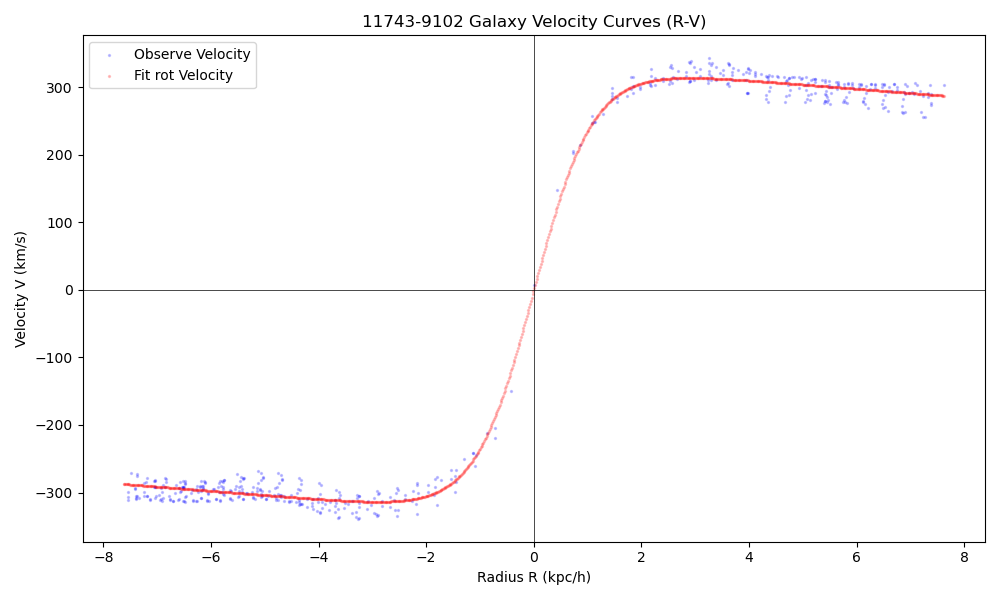
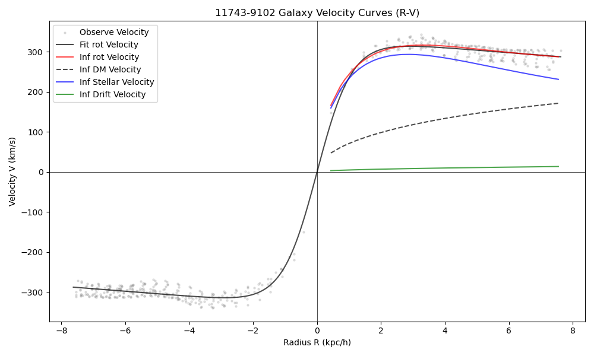
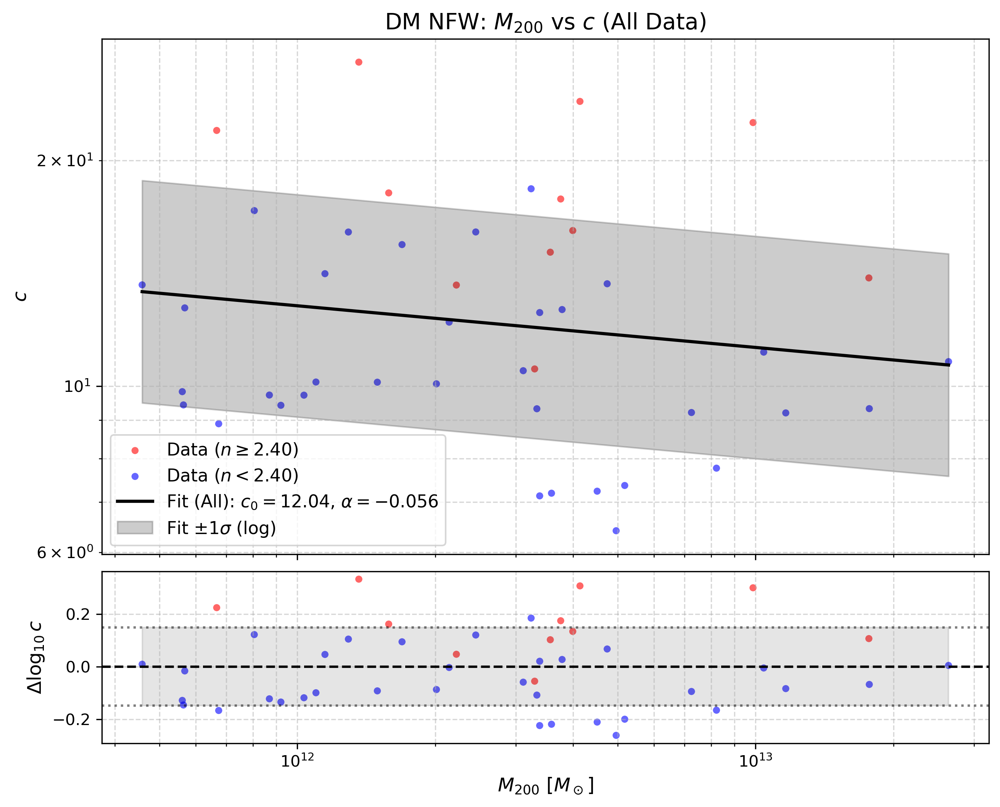
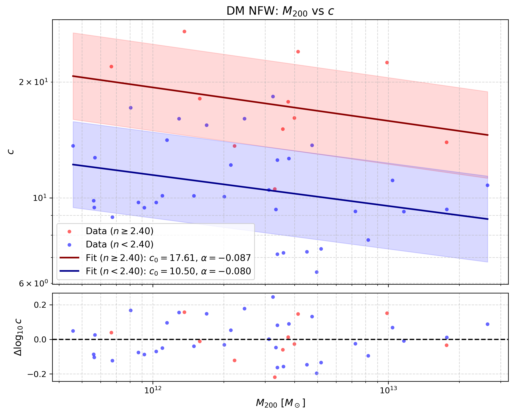

# 利用 MaNGA 星系旋转曲线推断暗物质晕参数

## 1. 引言

在现代宇宙学标准模型（$\Lambda$ CDM）的框架下，星系形成并演化于由暗物质主导的引力势阱（暗物质晕）中。高分辨率的冷暗物质（CDM）宇宙学 N 体模拟表明，暗物质晕的密度分布普遍遵循 Navarro-Frenk-White (NFW) 轮廓。该轮廓的特征是密度在中心区域呈现 $\rho \propto r^{-1}$ 的尖点（Cusp），而在外部区域以 $\rho \propto r^{-3}$ 的形式衰减。NFW 轮廓主要由两个关键物理参数决定：维里质量（$M_{200}$）和浓集度（$c$）。$M_{200}$ 代表了暗物质晕的整体规模与引力束缚范围；浓集度 $c$ 则反映了暗物质向中心聚集的程度。宇宙学模拟预言，$c$ 与 $M_{200}$ 之间存在反相关的标度关系（即质量越大的暗晕，形成时间越晚，中心浓集度越低），这一关系是检验暗物质本质和星系形成历史的重要探针。

在观测层面，星系的气体旋转曲线（Rotation Curve, RC）直接反映了星系内部的总引力势，是测量暗物质晕质量分布的最有效手段之一。本项目的核心目的：利用 MaNGA（Mapping Nearby Galaxies at Apache Point Observatory）积分场光谱（IFU）巡天提供的大样本二维运动学数据，提取高质量的星系气体旋转曲线，同时构建包含恒星盘、球核与暗物质晕的多组分动力学质量模型。在此基础上，我们采用马尔可夫链蒙特卡洛（MCMC）贝叶斯推断方法，精确测量星系暗物质晕的 $M_{200}$ 与 $c$。

在本项目中，我们在数百个星系样本上成功完成了上述 MCMC 动力学推断，获取了可靠的暗晕参数。基于这些观测推断结果，我们在观测层面上证实了暗物质晕浓集度与质量之间预期的负相关关系，同时定量拟合了 $c(M_{200})$ 标度关系的经验公式参数。进一步地，我们探讨了该关系与星系形态（Sérsic 指数）的物理关联。

## 2. 公式介绍

本项目的动力学建模基于牛顿引力理论与轴对称假设，推导与计算过程如下：

### 2.1 观测速度投影
星系盘面上半径为 $r$ 处的本征旋转速度 $V_{\mathrm{rot}}(r)$，投影到观测者视线方向的二维速度场 $V_{\mathrm{obs}}(r, \phi)$ 可表示为：
$$ V_{\mathrm{obs}}(r, \phi) = V_{\mathrm{sys}} + V_{\mathrm{rot}}(r) \sin i \cos(\phi - \phi_0) $$
其中，$V_{\mathrm{sys}}$ 为星系系统速度，$i$ 为星系盘倾角，$\phi$ 为天空平面上的方位角，$\phi_0$ 为运动学长轴的位置角。

### 2.2 经验旋转曲线拟合
在进行复杂的质量分解前，我们使用经验渐近函数对二维速度场进行快速优化拟合，以提取全局运动学特征并过滤低质量数据：
$$ V_{\mathrm{rot}}(r) = V_c \tanh\left(\frac{r}{R_t}\right) + s_{\mathrm{out}} r $$
其中 $V_c$ 为渐近速度振幅，$R_t$ 为表征内部速度梯度的翻转半径，$s_{\mathrm{out}}$ 允许外部旋转曲线线性上升或下降。

### 2.3 动力学质量分解
星系内部气体的旋转速度由总引力势决定。考虑到气体并非完全无碰撞，其热压力会提供部分抗引力支撑（非对称漂移），因此气体的本征旋转速度平方等于各质量组分贡献的圆速度平方之和，减去压力支撑项：
$$ V_{\mathrm{rot}}^2(r) = V_{\star}^2(r) + V_{\mathrm{dm}}^2(r) - V_{\mathrm{drift}}^2(r) $$

### 2.4 恒星组分 ($V_{\star}$)
恒星质量分布被建模为球对称的 Hernquist 核球（Bulge）与轴对称的 Freeman 指数盘（Disk）的叠加：
$$ V_{\star}^2(r) = V_{\mathrm{bulge}}^2(r) + V_{\mathrm{disk}}^2(r) $$
- **Hernquist 核球**：
  $$ V_{\mathrm{bulge}}^2(r) = \frac{G M_{\mathrm{bulge}} r}{(r+a)^2} $$
  其中 $M_{\mathrm{bulge}}$ 为核球质量，$a$ 为核球尺度半径。
- **Freeman 指数盘**：
  $$ V_{\mathrm{disk}}^2(r) = \frac{2 G M_{\mathrm{disk}}}{R_d} y^2 \left[ I_0(y)K_0(y) - I_1(y)K_1(y) \right] $$
  其中 $M_{\mathrm{disk}}$ 为盘质量，$R_d$ 为盘标泽长度，$y = r / (2 R_d)$，$I_n, K_n$ 为修正的贝塞尔函数。

### 2.5 暗物质晕组分 ($V_{\mathrm{dm}}$)
暗物质晕采用 NFW 密度轮廓，其贡献的圆速度平方为：
$$ V_{\mathrm{dm}}^2(r) = \frac{V_{200}^2}{x} \frac{\ln(1+cx) - \frac{cx}{1+cx}}{\ln(1+c) - \frac{c}{1+c}} $$
其中 $x = r/R_{200}$，$c$ 为浓集度参数（Concentration）。$V_{200}$ 为维里半径 $R_{200}$ 处的圆速度，与暗晕总质量 $M_{200}$ 的关系为 $V_{200} = (10 G H(z) M_{200})^{1/3}$。

### 2.6 非对称漂移修正 ($V_{\mathrm{drift}}$)
采用线性近似模型修正气体的压力支撑效应：
$$ V_{\mathrm{drift}}^2(r) = 2 \sigma_0^2 \left(\frac{r}{R_d}\right) $$
其中 $\sigma_0$ 为特征速度弥散尺度。

### 2.7 质量-浓集度关系 ($c-M_{200}$)
在获得大样本星系的暗晕参数后，我们拟合宇宙学标度的质量-浓集度线性关系：
$$ \log_{10} c = \log_{10} c_0 - \alpha \log_{10}\left(\frac{M_{200}}{10^{12} M_\odot}\right) $$
其中 $c_0$ 为特征质量 $10^{12} M_\odot$ 处的浓集度，$\alpha$ 为质量依赖的斜率。

## 3. 数据来源

本项目的数据主要来源于 SDSS-IV MaNGA 巡天及其增值星表。各项关键物理参数的具体来源及文件索引如下表所示：

| 参数名称 | 物理含义 | 来源文件 | 文件对应的索引/通道 |
| :--- | :--- | :--- | :--- |
| 红移 ($z$) | 星系的宇宙学红移，用于计算角直径距离和物理尺度 | DRPALL 星表 | `nsa_z` |
| 有效半径 ($R_e$) | 椭圆 Petrosian 半光半径（r 波段），用于锚定核球尺度 | DRPALL 星表 | `nsa_elpetro_th50_r` |
| Sérsic 指数 ($n$) | 单组分 Sérsic 轮廓拟合指数，用于约束核球质量分数 | DRPALL 星表 | `nsa_sersic_n` |
| 恒星质量 ($M_\star$) | 星系的总恒星质量，作为动力学推断的强物理先验 | DRPALL 星表 | `nsa_elpetro_mass` 或 `nsa_sersic_mass` |
| 极坐标半径 ($r$) | 去投影后的椭圆极坐标半径 | MAPS (DAP) FITS | `SPX_ELLCOO` (r 通道) |
| 观测速度场 ($V_{\mathrm{obs}}$) | H$\alpha$ 发射线的二维视向速度场 | MAPS (DAP) FITS | `EMLINE_GVEL` (H $\alpha$ 通道) |
| 逆方差 (IVAR) | 速度测量的逆方差，用于计算观测误差 ($\sigma_{\mathrm{ivar}}$) | MAPS (DAP) FITS | `EMLINE_GVEL_IVAR` (H $\alpha$ 通道) |
| 信噪比 (SNR) | H$\alpha$ 发射线的信噪比，用于过滤低质量数据点 | MAPS (DAP) FITS | `EMLINE_GFLUX` / `EMLINE_GFLUX_IVAR` |
| 方位角 ($\phi$) | 去投影后的椭圆极坐标方位角 | MAPS (DAP) FITS | `SPX_ELLCOO` (theta 通道) |
| 局部轴比 ($b/a$) | 局部椭圆拟合的短长轴之比 | MAPS (DAP) FITS | `SPX_ELLCOO` (ellipticity 通道) |

## 4. 分析过程

### 4.1 根据 INC 筛选星系
星系的倾角 $i$ 对去投影速度的计算至关重要。我们利用 DRPALL 中的轴比（`NSA_SERSIC_BA`）近似计算倾角。为了避免正面星系（$i < 25^\circ$）带来的巨大去投影误差（$\sin i$ 趋于 0），以及侧面星系（$i > 70^\circ$）严重的视线积分效应和尘埃消光，我们严格筛选倾角在 $25^\circ \le i \le 70^\circ$ 范围内的星系进入后续分析。

### 4.2 使用 RC 优化拟合的方法，筛选星系和星系的数据
在进行复杂的 MCMC 质量分解前，先使用经验渐近函数（见公式 2.2）对二维速度场进行快速优化拟合：
- **数据点（Spaxel）过滤**：仅保留 $\text{SNR} \ge 10.0$ 且方位角位于运动学长轴 $\pm 45^\circ$ 范围内的像素点，以抑制非圆运动（如旋臂流、棒结构）的干扰。同时，剔除 IVAR 最低的 10% 数据点以去除异常噪声。
- **星系级过滤**：使用 Levenberg-Marquardt 算法进行加权拟合。根据拟合残差，剔除归一化均方根误差（$\text{NRMSE} > 0.1$）或约化卡方（$\chi^2 > 10$）过大的星系，确保进入 MCMC 阶段的星系具有规则且高质量的旋转曲线。

  

*图 4.2：星系二维速度场的经验旋转曲线（RC）优化拟合示例。*

### 4.3 使用 MCMC 方法推断 $c$ 和 $M_{200}$
基于公式（2.1）及（2.3）至（2.6），我们在 PyMC 框架下构建贝叶斯模型，使用 NUTS 采样器推断暗物质晕参数。在实际推断中，如果仅仅依靠旋转曲线（RC）的物理公式进行约束，由于公式（2.3）至（2.6）涉及的自由参数过多（如核球质量、盘质量、暗晕质量与浓集度等），且缺乏其他物理背景的额外限制，模型会面临极其严重的参数简并问题（尤其是盘-晕简并）。因此，在实际项目开发中，我们进行了 MCMC 先验参数的调试与似然函数的优化，以引入更多物理约束。具体的贝叶斯框架设置如下：

**1. 物理先验（Priors）的精细设定**
为打破简并并确保物理合理性，我们为各参数设定了强物理先验：
- **恒星质量 ($M_{\star}$)**：采用对数正态先验 $\mathcal{LN}(\mu = \ln M_{\star,\mathrm{obs}}, \sigma = 0.05 \ln 10)$。将其紧密锚定在 DRPALL 提供的观测值上，仅允许 0.05 dex 的浮动。
- **暗物质晕质量 ($M_{200}$)**：通过恒星-暗晕质量关系（SHMR）施加 $\sigma=0.2$ dex 的对数正态先验。
- **浓集度 ($c$)**：采用对数正态先验。中心值设为 $c \approx 9$（$\sigma=0.2$ dex）。
- **核球质量分数 ($f_{\mathrm{bulge}}$)**：为避免星系族群关系的随机性，我们将其与星系自身的 Sérsic 指数 $n$ 耦合，采用经验 logit-线性关系：$\text{logit}(f_{\mathrm{bulge}}) \sim \mathcal{N}(\mu = 1.2(n - 2.5), \sigma = 0.2)$。
- **核球尺度 ($a$)**：$\mathcal{LN}(\mu = \ln(0.13 R_e), \sigma = 0.3)$。基于核球尺寸的经验标度关系设定，防止 MCMC 采样时出现非物理的极值。
- **速度弥散 ($\sigma_0$)**：$\mathcal{LN}(\mu = \ln 5, \sigma = 0.3 \ln 10)$ km/s，为非对称漂移修正提供弱信息先验。
- **几何参数**：系统速度 $V_{\mathrm{sys}}$、倾角 $i$ 和运动学位置角偏移 $\phi_{\mathrm{delta}}$ 均基于 2D 几何拟合结果，赋予极窄的正态或截断正态先验。
- **误差缩放因子 ($\sigma_{\mathrm{scale}}$)**：引入乘性因子 $\mathcal{LN}(\mu = \ln\sqrt{\bar{\sigma}_{\mathrm{ivar}}^2 + \sigma_{\mathrm{sys}}^2}, \sigma = 0.3)$，以吸收 IFU 速度不确定度可能被低估的影响。

**2. 似然函数（Likelihood）与空间降权**
- **高斯似然**：假设观测速度服从高斯分布，其误差由观测逆方差和缩放因子共同决定：$V_{\mathrm{obs}} \sim \mathcal{N}(V_{\mathrm{obs,model}}, \sigma_{\mathrm{scale}} \sigma_{\mathrm{ivar}})$。
- **中心区域降权（Spatial Weighting）**：为减轻中心区域光束平滑（Beam Smearing）及非圆运动的干扰，我们在对数似然中引入了辅助势函数。通过 Logistic Ramp 函数，对内部 30% 半径范围内的数据点施加平滑降权。这一关键调试确保了全局暗晕参数主要由更可靠的外部旋转曲线驱动。

**3. 后验推断**
通过上述精心调试的模型，使用 MCMC 采样，最终获得 $M_{200}$ 和 $c$ 的边缘后验分布及不确定度。

  

*图 4.3：单个星系多组分动力学质量分解的 MCMC 后验推断结果。*

### 4.4 拟合 $c-M_{200}$ 关系并分析 Sérsic $n$ 的影响
提取大样本星系的 $M_{200}$ 和 $c$ 后验中值后，我们再次使用 MCMC 方法拟合宇宙学标度的质量-浓集度线性关系（见公式 2.7）。
在星系形态学中，普遍认为 Sérsic 指数 $n = 2.5$ 是区分盘主导（晚型）和核球主导（早型）星系的临界值。在我们的数据分析中，通过对样本的统计特征进行划分，得出的实际临界值为 $n = 2.4$，这与理论预期高度一致。

基于这一发现，我们以 $n = 2.4$ 为界，将星系样本划分为高 $n$ 值（核球主导）和低 $n$ 值（盘主导）两个子样本，并分别对它们进行 $c-M_{200}$ 经验公式的拟合。结果表明，通过引入形态学分类，我们能够为 $c_0$ 和 $\alpha$ 参数获得误差更小、置信度更高的拟合结果。

具体而言，拟合结果显示：**两个子样本的质量依赖斜率 $\alpha$ 基本一致，但高 $n$ 值星系的特征浓集度 $c_0$ 显著更高**。这一结论具有重要的物理意义：
1. **$\alpha$ 值的一致性**：$\alpha$ 反映了暗晕浓集度随质量变化的标度关系。两个子样本的 $\alpha$ 值相近，说明暗物质晕的底层宇宙学组装规律（即低质量暗晕形成更早、浓集度更高）是普适的，不依赖于其内部重子物质的最终形态。
2. **高 $n$ 值具有更高的 $c_0$**：$c_0$ 代表了在相同暗晕质量（如 $10^{12} M_\odot$）下的基准浓集度。高 $n$ 值（核球主导）星系通常经历了更剧烈的气体流入、中心星暴或星系并合过程，大量重子物质向星系中心高度聚集，极大地加深了中心区域的引力势阱。这种强烈的重子引力作用会拖拽周围的暗物质向中心塌缩，即引发了更显著的**重子冷却收缩效应（Baryonic Cooling/Adiabatic Contraction）**。因此，在相同的总暗晕质量下，核球主导星系的中心暗物质密度更高，表现为更大的 $c_0$ 值。

  
  

*图 4.4：大样本星系的 $c-M_{200}$ 关系拟合结果。左图（a）展示了未区分Sérsic 指数的拟合情况 ；右图（b）展示了Sérsic 指数（$n < 2.4$，盘主导）子样本的拟合和高 Sérsic 指数（$n \ge 2.4$，核球主导）子样本分别拟合的情况。对比可见，两者的质量依赖斜率 $\alpha$ 基本一致，但高 $n$ 值星系具有显著更高的特征浓集度 $c_0$。*

## 5. 总结

### 5.1 项目总结
本项目开发了一套自动化的数据处理与贝叶斯推断管线，能够从 MaNGA IFU 原始数据中稳健地提取星系旋转曲线，并完成多组分动力学质量分解。通过将测光形态学参数（Sérsic $n$、$R_e$）与恒星质量（DRPALL）作为强物理先验深度融入动力学模型，缓解了星系动力学中“盘-晕简并”问题，获得了具有物理一致性的暗物质晕参数（$M_{200}$, $c$）。

### 5.2 缺陷与已知问题
1. **光束平滑效应（Beam Smearing）**：MaNGA 的空间分辨率（FWHM $\sim 2.5''$）会人为压平星系中心区域的速度梯度。尽管我们采用了中心降权策略，但未在似然函数中进行严格的 2D PSF 卷积前向建模，这可能导致内部质量（如核球参数）的推断存在系统性偏差。
2. **盘-晕简并的残留**：尽管引入了强先验，但在光学盘的特征尺度附近，重子物质与暗物质的引力响应仍高度重叠。如果 DRPALL 提供的恒星质量存在系统误差，该误差仍会传递给暗物质晕参数。
3. **绝热收缩（Adiabatic Contraction）**：当前模型假设暗物质晕遵循纯 NFW 轮廓（基于纯暗物质 N-body 模拟）。实际上，重子物质向中心塌缩会引发暗晕的绝热收缩，改变内部密度斜率。未考虑此效应可能导致推断的 $c$ 值偏高。
4. **固定几何假设**：模型假设星系的倾角 $i$ 和位置角 $\phi_0$ 随半径恒定，未考虑星系外盘可能存在的翘曲（Warping）现象。
5. **$c-M_{200}$ 参数简并**：由于暗物质晕的浓集度 $c$ 与维里质量 $M_{200}$ 在物理意义上存在负相关关系，在 MCMC 动力学推断中，这两个参数的后验分布往往表现出极强的负相关性（相关系数通常超过 -0.8）。这种强烈的参数简并意味着，在拟合相同的旋转曲线时，较高的 $M_{200}$ 伴随较低的 $c$（或反之）都能产生相似的暗晕引力势。这会导致单个星系的 $c$ 和 $M_{200}$ 绝对数值的推断不确定度增大，从而影响参数测量的独立准确性。

### 5.3 可能的优化方法
- **引入 PSF 卷积**：在 MCMC 的每一步生成高分辨率 2D 速度场，与 MaNGA PSF 卷积后再与观测数据计算似然，以彻底解决光束平滑问题。
- **结合恒星动力学**：引入恒星速度弥散度（Stellar Kinematics）数据，利用 Jeans 各向异性模型（JAM）提供额外的动力学约束。
- **采用修正的暗晕模型**：使用包含重子反馈效应的暗晕密度轮廓（如 DC14 模型或直接引入绝热收缩修正因子），以更真实地反映星系中心的暗物质分布。

## 6. 引用

1. Planck Collaboration 2020, Aghanim, N., Akrami, Y., et al. (2020). Planck2018 results: VI. Cosmological parameters. *Astronomy & Astrophysics*, 641, A6.
2. Perlmutter, S., Aldering, G., Goldhaber, G., et al. (1999). Measurements of $\Omega$ and $\Lambda$ from 42 High-Redshift Supernovae. *The Astrophysical Journal*, 517(2), 565–586.
3. Navarro, J. F., Frenk, C. S., & White, S. D. M. (1997). A Universal Density Profile from Hierarchical Clustering. *The Astrophysical Journal*, 490(2), 493–508.
4. Navarro, J. F., Ludlow, A., Springel, V., et al. (2009). The diversity and similarity of simulated cold dark matter haloes: Diversity and similarity of simulated CDM haloes. *Monthly Notices of the Royal Astronomical Society*, 402(1), 21–34.
5. White, S. D. M., & Rees, M. J. (1978). Core condensation in heavy halos: a two-stage theory for galaxy formation and clustering. *Monthly Notices of the Royal Astronomical Society*, 183(3), 341–358.
6. Benson, A. J. (2010). Galaxy formation theory. *Physics Reports*, 495(2-3), 33–86.
7. Wechsler, R. H., Bullock, J. S., Primack, J. R., Kravtsov, A. V., & Dekel, A. (2002). Concentrations of dark halos from their assembly histories. *The Astrophysical Journal*, 568(1), 52.
8. Courteau, S. (1997). Optical rotation curves and line widths for Tully-Fisher applications. *The Astronomical Journal*, 114(6), 2402–2427.
9. Newville, M., Stensitzki, T., Allen, D. B., & Ingargiola, A. (2014). LMFIT: Non-linear least-square minimization and curve-fitting for Python. *Zenodo*.
10. Westfall, K. B., et al. (2019). The Data Analysis Pipeline for the SDSS-IV MaNGA IFU Galaxy Survey: Overview. *The Astronomical Journal*.
11. Dutton, A. A., & Macciò, A. V. (2014). Cold dark matter haloes in the Planck era: evolution of structural parameters for Einasto and NFW profiles. *Monthly Notices of the Royal Astronomical Society*.