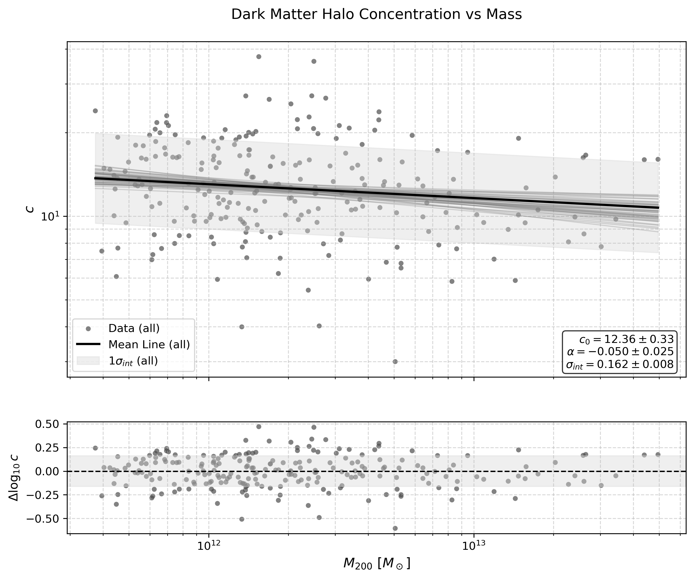
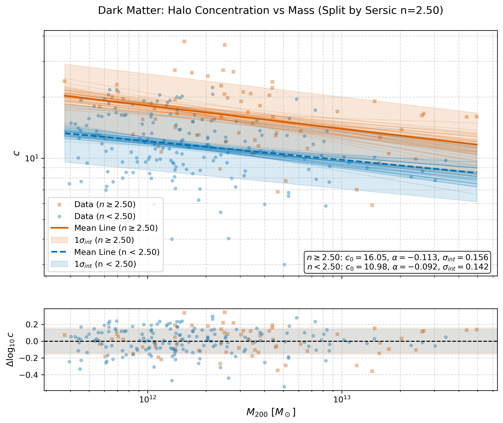
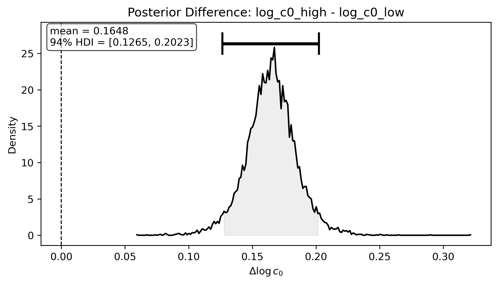
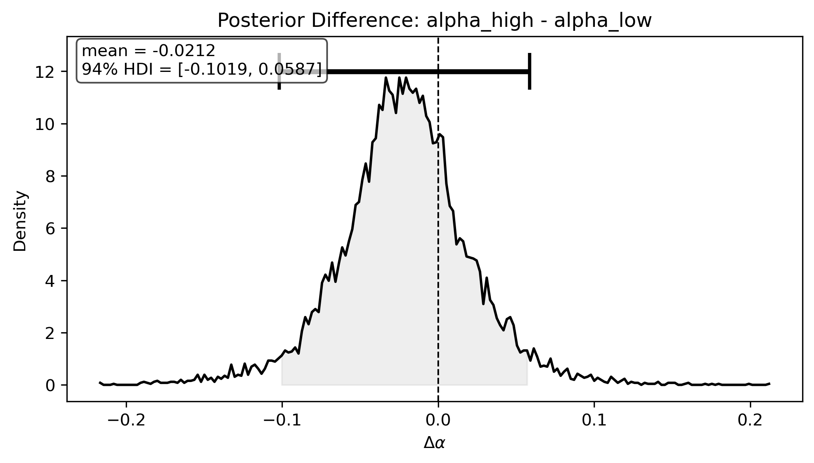

# 基于 MaNGA 动力学建模研究星系暗物质晕的浓度-质量关系

## 1. 引言

在现代宇宙学标准模型（$\Lambda$ CDM）的框架下，星系形成并演化于由暗物质主导的引力势阱（暗物质晕）中。高分辨率的冷暗物质（CDM）宇宙学 N 体模拟表明，暗物质晕的密度分布普遍遵循 Navarro-Frenk-White (NFW) 轮廓。该轮廓的特征是密度在中心区域呈现 $\rho \propto r^{-1}$ 的尖点（Cusp），而在外部区域以 $\rho \propto r^{-3}$ 的形式衰减。NFW 轮廓主要由两个关键物理参数决定：维里质量（$M_{200}$）和浓集度（$c$）。$M_{200}$ 代表了暗物质晕的整体规模与引力束缚范围；浓集度 $c$ 则反映了暗物质向中心聚集的程度。宇宙学模拟预言，$c$ 与 $M_{200}$ 之间存在反相关的标度关系（即质量越大的暗晕，形成时间越晚，中心浓集度越低），这一关系是检验暗物质本质和星系形成历史的重要探针。

在观测层面，星系的气体旋转曲线（Rotation Curve, RC）直接反映了星系内部的总引力势，是测量暗物质晕质量分布的最有效手段之一。本项目的核心目的：利用 MaNGA（Mapping Nearby Galaxies at Apache Point Observatory）积分场光谱（IFU）巡天提供的大样本二维运动学数据，提取高质量的星系气体旋转曲线，同时构建包含恒星盘、球核与暗物质晕的多组分动力学质量模型。在此基础上，我们采用马尔可夫链蒙特卡洛（MCMC）贝叶斯推断方法，精确测量星系暗物质晕的 $M_{200}$ 与 $c$。

在本项目中，我们在数百个星系样本上成功完成了上述 MCMC 动力学推断，获取了可靠的暗晕参数。基于这些观测推断结果，我们在观测层面上证实了暗物质晕浓集度与质量之间预期的负相关关系，同时定量拟合了 $c(M_{200})$ 标度关系的经验公式参数。进一步地，我们探讨了该关系与星系形态（Sérsic 指数）的物理关联。

## 2. 原理

### 2.1 观测速度投影与经验旋转曲线拟合
星系盘面上半径为 $r$ 处的本征旋转速度 $V_{\mathrm{rot}}(r)$，投影到观测者视线方向的二维速度场 $V_{\mathrm{obs}}(r, \phi)$ 可表示为：
$$ V_{\mathrm{obs}}(r, \phi) = V_{\mathrm{sys}} + V_{\mathrm{rot}}(r) \sin i \cos(\phi - \phi_0) \tag{1}$$
其中，$V_{\mathrm{sys}}$ 为星系系统速度，$i$ 为星系盘倾角，$\phi$ 为天空平面上的方位角，$\phi_0$ 为运动学长轴的位置角。

在进行复杂的质量分解前，我们使用经验渐近函数对二维速度场进行快速优化拟合，以提取全局运动学特征并过滤低质量数据：
$$ V_{\mathrm{rot}}(r) = V_c \tanh\left(\frac{r}{R_t}\right) + s_{\mathrm{out}} r \tag{2}$$
其中 $V_c$ 为渐近速度振幅，$R_t$ 为表征内部速度梯度的翻转半径，$s_{\mathrm{out}}$ 允许外部旋转曲线线性上升或下降。

### 2.2 动力学质量分解
星系内部气体的旋转速度由总引力势决定。考虑到气体并非完全无碰撞，其热压力会提供部分抗引力支撑（非对称漂移），因此气体的本征旋转速度平方等于各质量组分贡献的圆速度平方之和，减去压力支撑项：
$$ V_{\mathrm{rot}}^2(r) =V_{\mathrm{baryon}}^2(r) + V_{\mathrm{dm}}^2(r) - V_{\mathrm{drift}}^2(r) \tag{3}$$

在质量分解中，我们在本工作里**忽略气体（gas）质量的直接贡献**，即不单独计算 $V_{\mathrm{gas}}$ 项；相应地，使用恒星组分的圆速度 $V_{\star}$ 作为对总重子物质圆速度 $V_{\mathrm{baryon}}$ 的近似：$V_{\mathrm{baryon}} \approx V_{\star}$。此近似在星系气体质量相对恒星质量较小时成立，并简化了模型以减轻参数简并。

#### 2.2.1 恒星组分
恒星质量分布被建模为球对称的 Hernquist 核球（Bulge）与轴对称的 Freeman 指数盘（Disk）的叠加：
$$ V_{\star}^2(r) = V_{\mathrm{bulge}}^2(r) + V_{\mathrm{disk}}^2(r) \tag{4}$$

在模型中，我们引入核球质量分数 $f_{\mathrm{bulge}}$，将总恒星质量 $M_{\star}$ 分解为核球质量 $M_{\mathrm{bulge}}$ 和盘质量 $M_{\mathrm{disk}}$。

- Hernquist 核球：
  $$ V_{\mathrm{bulge}}^2(r) = \frac{G M_{\mathrm{bulge}} r}{(r+a)^2} \tag{5} $$
  其中 $M_{\mathrm{bulge}}$ 为核球质量：$ M_{\mathrm{bulge}} = f_{\mathrm{bulge}} M_{\star} $，$a$ 为核球尺度半径。

- Freeman 指数盘：
  $$ V_{\mathrm{disk}}^2(r) = \frac{2 G M_{\mathrm{disk}}}{R_d} y^2 \left[ I_0(y)K_0(y) - I_1(y)K_1(y) \right] \tag{6} $$
  其中 $M_{\mathrm{disk}}$ 为盘质量：$ M_{\mathrm{disk}} = (1 - f_{\mathrm{bulge}}) M_{\star} $，$y = r / (2 R_d)$，$I_n, K_n$ 为修正的贝塞尔函数。$R_d$ 为盘标度长度（Disk scale length），在此模型中，盘标度长度 $R_d$ 与星系的有效半径（或半质量半径）$R_e$ 满足关系：$R_e = 1.68 R_d$。

#### 2.2.2 暗物质晕组分
暗物质晕采用 NFW 密度轮廓，其贡献的圆速度平方为：
$$ V_{\mathrm{dm}}^2(r) = \frac{V_{200}^2}{x} \frac{\ln(1+cx) - \frac{cx}{1+cx}}{\ln(1+c) - \frac{c}{1+c}} \tag{7}$$
其中 $c$ 为浓集度参数（Concentration），$x = r/R_{200}$ 为归一化半径。$R_{200}$ 与维里速度 $V_{200}$ 的关系为：
$$ R_{200} = \frac{V_{200}}{10 H(z)} \tag{8}$$
维里速度 $V_{200}$ 与暗晕总质量 $M_{200}$ 的关系为：
$$ V_{200} = \left(10 G H(z) M_{200}\right)^{1/3} \tag{9}$$
其中 $H(z)$ 为红移 $z$ 处的哈勃参数：
$$ H(z) = H_0 \sqrt{\Omega_m(1+z)^3 + \Omega_\Lambda} \tag{10}$$

#### 2.2.3 非对称漂移修正
采用线性近似模型修正气体的压力支撑效应：
$$ V_{\mathrm{drift}}^2(r) = 2 \sigma_0^2 \left(\frac{r}{R_d}\right) \tag{11}$$
其中 $\sigma_0$ 为特征速度弥散尺度，$R_d$ 为盘标度长度，且与有效半径 $R_e$ 满足 $R_e = 1.68 R_d$ 的关系。

### 2.3 恒星-暗晕质量关系 (SHMR)
本工作采用 Moster et al. (2013) 风格的 SHMR 参数化：
$$ \frac{M_{\star}}{M_{\mathrm{halo}}} = 2N \left[\left(\frac{M_{\mathrm{halo}}}{M_1}\right)^{-\beta} + \left(\frac{M_{\mathrm{halo}}}{M_1}\right)^{\gamma} \right]^{-1} \tag{12}$$
其中常用参数为 $M_1, N, \beta, \gamma$。该模型中各参数的物理含义及本工作采用的基准值如下：
- **$M_1$（特征暗晕质量）**：用于标定 SHMR 的转折质量尺度，基准值为 $M_1 = 10^{11.59}\,h^{-1} M_\odot$。
- **$N$（归一化）**：控制 $M_{\star}/M_{\mathrm{halo}}$ 在转折尺度附近的振幅，基准值为 $N=0.0351$。
- **$\beta$（低质量端斜率）**：描述在 $M_{\mathrm{halo}} \ll M_1$ 时 $M_{\star}/M_{\mathrm{halo}}$ 随质量的标度行为（低质量端的幂律指数），基准值为 $\beta=1.376$。
- **$\gamma$（高质量端斜率）**：描述在 $M_{\mathrm{halo}} \gg M_1$ 时的高质量端斜率，基准值为 $\gamma=0.608$。

### 2.4 质量-浓集度关系 ($c-M_{200}$)
在获得大样本星系的暗晕参数后，我们拟合宇宙学标度的质量-浓集度线性关系：
$$ \log_{10} c = \log_{10} c_0 - \alpha \log_{10}\left(\frac{M_{200}}{10^{12} M_\odot}\right) \tag{13}$$
其中 $c_0$ 为特征质量 $10^{12} M_\odot$ 处的浓集度，$\alpha$ 为质量依赖的斜率。

## 3. 数据来源

本项目的数据主要来源于 SDSS-IV MaNGA 巡天数据。各项关键物理参数的具体来源及文件索引如下表所示：

| 参数名称 | 物理含义 | 对应公式 | 来源文件 | 文件对应的索引/通道 |
| :--- | :--- | :--- | :--- | :--- |
| 红移 ($z$) | 星系的宇宙学红移，用于计算角直径距离和物理尺度 | (10) | DRPALL$^{[12]}$ | `nsa_z` |
| 有效半径 ($R_e$) | 椭圆 Petrosian 半光半径（r 波段），用于锚定核球尺度 | (6)(11) | DRPALL$^{[12]}$ | `nsa_elpetro_th50_r` |
| Sérsic 指数 ($n$) | 单组分 Sérsic 轮廓拟合指数，用于约束核球质量分数 | - | DRPALL$^{[12]}$ | `nsa_sersic_n` |
| 恒星质量 ($M_\star$) | 星系的总恒星质量，作为动力学推断的强物理先验 | (12) | DRPALL$^{[12]}$ | `nsa_elpetro_mass` 或 `nsa_sersic_mass` |
| 极坐标半径 ($r$) | 去投影后的椭圆极坐标半径 | (1)-(7), (11) | MAPS (DAP) FITS$^{[13]}$ | `SPX_ELLCOO` (r 通道) |
| 观测速度场 ($V_{\mathrm{obs}}$) | H$\alpha$ 发射线的二维视向速度场 | (1) | MAPS (DAP) FITS$^{[13]}$ | `EMLINE_GVEL` (H $\alpha$ 通道) |
| 逆方差 (IVAR) | 速度测量的逆方差，用于计算观测误差 ($\sigma_{\mathrm{ivar}}$) | - | MAPS (DAP) FITS$^{[13]}$ | `EMLINE_GVEL_IVAR` (H $\alpha$ 通道) |
| 信噪比 (SNR) | H$\alpha$ 发射线的信噪比，用于过滤低质量数据点 | - | MAPS (DAP) FITS$^{[13]}$ | `EMLINE_GFLUX` / `EMLINE_GFLUX_IVAR` |
| 方位角 ($\phi$) | 去投影后的椭圆极坐标方位角 | (1) | MAPS (DAP) FITS$^{[13]}$ | `SPX_ELLCOO` (theta 通道) |
| 局部轴比 ($b/a$) | 局部椭圆拟合的短长轴之比 | (1) | MAPS (DAP) FITS$^{[13]}$ | `SPX_ELLCOO` (ellipticity 通道) |

## 4. 分析过程

### 4.1 根据倾角 i 筛选星系
星系的倾角 $i$ 用于投影速度的计算公式（1）。为了避免正面星系（$i < 25^\circ$）带来的巨大去投影误差（$\sin i$ 趋于 0），以及侧面星系（$i > 70^\circ$）严重的视线积分效应和尘埃消光，我们严格筛选倾角在 $25^\circ \le i \le 70^\circ$ 范围内的星系进入后续分析。我们利用 DRPALL 中的轴比（`NSA_SERSIC_BA`）近似计算倾角。

### 4.2 使用 RC 优化拟合的方法，筛选星系和星系的数据
在进行复杂的 MCMC 质量分解前，先对观测速度使用公式(1)进行投影几何校正获取到$V_{\mathrm{rot}}$，然后使用经验渐近函数（见公式 2）对$V_{\mathrm{rot}}$进行非线性优化拟合：
- **数据点（Spaxel）过滤**：仅保留 $\text{SNR} \ge 10.0$ 且方位角位于运动学长轴 $\pm 45^\circ$ 范围内的像素点，以抑制非圆运动（如旋臂流、棒结构）的干扰。同时，剔除 IVAR 最低的 10% 数据点以去除异常噪声。
- **星系级过滤**：使用 Levenberg-Marquardt 算法进行加权拟合。根据拟合残差，剔除归一化均方根误差（$\text{NRMSE} > 0.1$）或约化卡方（$\chi^2 > 10$）过大的星系，确保进入 MCMC 阶段的星系具有规则且高质量的旋转曲线。

  

*图 4.2：星系二维速度场的经验旋转曲线（RC）优化拟合示例。*

### 4.3 使用 MCMC 方法推断 $c$ 和 $M_{200}$
基于公式（3），我们在 PyMC 框架下构建贝叶斯模型，使用 NUTS 采样器推断暗物质晕参数。在实际推断中，如果仅仅依靠旋转曲线（RC）的物理公式进行约束，由于公式（3）至（11）涉及的自由参数过多（如核球质量、盘质量、暗晕质量与浓集度等），且缺乏其他物理背景的额外限制，模型会面临极其严重的参数简并问题（尤其是盘-晕简并）。因此，在实际项目开发中，我们进行了 MCMC 先验参数的调试与似然函数的优化，以引入更多物理约束。具体的贝叶斯框架设置如下：

#### 4.3.1 物理先验（Priors）的设定
为打破简并并确保物理合理性，我们为各参数设定了强物理先验：

| 参数名称 | 参数含义 | 相关的公式号 | 值的来源 | 先验模型 | 期望值 | sigma值 |
| :--- | :--- | :--- | :--- | :--- | :--- | :--- |
| 恒星质量 ($M_{\star}$) | 星系的总恒星质量 | (4)-(6), (12) | 观测值 | 对数正态先验 $\mathcal{LN}$ | $M_{\star,\mathrm{obs}}$ | $0.05 \ln 10$ (0.05 dex) |
| 暗物质晕质量 ($M_{200}$) | 暗物质晕的维里质量 | (9), (13) | 基于SHMR公式计算值 | 对数正态先验 $\mathcal{LN}$ | $M_{200,\mathrm{SHMR}}$ | $0.2 \ln 10$ (0.2 dex) |
| 浓集度 ($c$) | 暗物质晕的浓集度参数 | (7), (13) | 理论经验值 | 对数正态先验 $\mathcal{LN}$ | $c \approx 9$ | $0.2 \ln 10$ (0.2 dex) |
| 核球质量分数 ($f_{\mathrm{bulge}}$) | 核球质量占总恒星质量的比例 | (5), (6) | 基于Sérsic $n$计算值 | logit-正态先验 $\mathcal{N}$ | $\mu = 1.2(n - 2.5)$ | $0.2$ |
| 核球尺度 ($a$) | Hernquist 核球的尺度半径 | (5) | 基于$R_e$的计算值 | 对数正态先验 $\mathcal{LN}$ | $0.13 R_e$ | $0.3$ |
| 速度弥散 ($\sigma_0$) | 气体的特征速度弥散尺度 | (11) | 理论经验值 | 对数正态先验 $\mathcal{LN}$ | $5$ km/s | $0.3 \ln 10$ |
| 系统速度 ($V_{\mathrm{sys}}$) | 星系整体的视向速度 | (1) | RC拟合结果 | 截断正态先验 $\mathcal{N}$ | 拟合值 | 基于拟合误差 |
| 盘倾角 ($i$) | 星系盘面与天空平面的夹角 | (1) | RC拟合结果 | 正态先验 $\mathcal{N}$ | 拟合值 | 基于拟合误差 |
| 位置角偏移 ($\phi_{\mathrm{delta}}$) | 运动学长轴的位置角偏移 | (1) | RC拟合结果 | 截断正态先验 $\mathcal{N}$ | 拟合值 | 基于拟合误差 |
| 误差缩放因子 ($\sigma_{\mathrm{scale}}$) | 观测速度误差的乘性修正因子 | - | 观测逆方差与系统误差的综合 | 对数正态先验 $\mathcal{LN}$ | $\sqrt{\bar{\sigma}_{\mathrm{ivar}}^2 + \sigma_{\mathrm{sys}}^2}$ | $0.3$ |

#### 4.3.2 似然函数（Likelihood）与空间降权
- **高斯似然**：假设观测速度服从高斯分布，其误差由观测逆方差和缩放因子共同决定：$V_{\mathrm{obs}} \sim \mathcal{N}(V_{\mathrm{obs,model}}, \sigma_{\mathrm{scale}} \sigma_{\mathrm{ivar}})$。
- **中心区域降权（Spatial Weighting）**：为减轻中心区域光束平滑（Beam Smearing）及非圆运动的干扰，我们在对数似然中引入了辅助势函数。通过 Logistic Ramp 函数，对内部 30% 半径范围内的数据点施加平滑降权。这一关键调试确保了全局暗晕参数主要由外部旋转曲线驱动。

#### 4.3.3 后验推断与协方差矩阵提取
通过上述调试的模型，使用 MCMC 采样，最终获得 $M_{200}$ 和 $c$ 的边缘后验分布及不确定度。

需要指出的是，由于暗物质晕的浓集度 $c$ 与维里质量 $M_{200}$ 在动力学效应上存在强烈的物理简并（即较高的质量伴随较低的浓集度也能产生相似的引力势），它们的联合后验分布通常呈现出高度相关的“香蕉”状（Banana-shape）。为了在后续的总体样本分析中无损地传递这种参数简并与不确定性，我们不仅提取了后验的期望值（Mean），还基于马哈拉诺比斯距离（Mahalanobis distance）提取了 2-$\sigma$ 核心样本，并计算了其协方差矩阵。这一协方差矩阵完整记录了每个星系 $M_{200}$ 和 $c$ 的观测误差及其相关性，为下一阶段的层次贝叶斯建模（HBM）提供了严谨的数据基础。

  
  

*图 4.3：左图展示了单个星系多组分动力学质量分解的 MCMC 后验推断的结果（使用 Maximum A Posteriori 值展示）；右图特写了暗物质晕质量 $M_{200}$ 与浓集度 $c$ 的二维核密度估计（KDE）图，清晰展示了两者之间强烈的负相关“香蕉”状简并结构，图中的椭圆轮廓代表了基于马哈拉诺比斯距离提取的 1-$\sigma$ 和 2-$\sigma$ 协方差矩阵范围。*

### 4.4 拟合 $c-M_{200}$ 关系并分析 Sérsic $n$ 的影响

在获取大样本星系的 $M_{200}$ 和 $c$ 的期望值及协方差矩阵后，我们按照公式-13去拟合宇宙学标度的质量-浓集度的非线性关系。

正如 David W. Hogg 等人（2010）在数据拟合的经典文献中所强调的，在天体物理数据处理中，当自变量（$M_{200}$）和因变量（$c$）都存在显著的观测误差，且这些误差之间存在强烈的协方差（即 4.3 节中提到的参数简并）时，忽略这些误差结构会导致拟合结果产生严重的系统性偏差（如衰减偏差，Attenuation bias）。此外，星系作为复杂的物理系统，其 $c-M_{200}$ 关系必然存在并非由观测误差引起的本征散射（Intrinsic scatter）。

为此，我们摒弃了简单的最小二乘法拟合标度关系，构建了一个严谨的层次贝叶斯模型（Hierarchical Bayesian Model, HBM）：
1. **引入潜变量（Latent Variables）**：假设每个星系存在一个真实的暗晕质量 $M_{\mathrm{true}}$ 和真实的浓集度 $c_{\mathrm{true}}$，它们严格遵循带有本征散射 $\sigma_{\mathrm{int}}$ 的 $c-M_{200}$ 标度关系。
2. **前向建模观测过程（Forward Modeling）**：将 4.3 节中获取的期望值作为观测数据，并使用 2-$\sigma$ 协方差矩阵构建多元高斯似然函数。这意味着模型在拟合时，会自动沿着每个星系误差椭圆（协方差）的方向进行概率权重的调整，从而自然地处理了 $M_{200}$ 和 $c$ 的强简并。
3. **联合推断**：使用 MCMC 方法同时对标度关系的截距 $\log_{10} c_0$、斜率 $\alpha$、本征散射 $\sigma_{\mathrm{int}}$ 以及所有星系的潜变量进行联合后验采样。

进一步地，我们探讨了星系形态对暗晕结构的影响。普遍认为 Sérsic 指数 $n = 2.5$ 是区分盘主导（晚型）和核球主导（早型）星系的经验临界值。我们将星系样本划分为高 $n$ 值（$n \ge 2.5$，核球主导）和低 $n$ 值（$n < 2.5$，盘主导）两个子样本，并分别进行 HBM 拟合。

  
  

*图 4.4：星系的 $c-M_{200}$ 关系拟合结果（Spaghetti Plot）。图中的半透明细线代表从 MCMC 后验中随机抽取的拟合结果，直观展示了模型的不确定性；阴影区域表示推断出的本征散射 $\sigma_{\mathrm{int}}$。左图（a）为全体样本的拟合；右图（b）为按 Sérsic 指数 $n=2.5$ 划分的子样本拟合。对比可见，高 $n$ 值星系（橙色）整体具有更高的特征浓集度。*

为了在统计上严格验证这种形态学依赖性，我们计算了两个子样本在截距 $\log_{10} c_0$ 和斜率 $\alpha$ 上的后验差异分布（Posterior Difference）。

  
  

*图 4.5：高 $n$ 值与低 $n$ 值样本拟合参数的后验差异分布。左图为截距差异 $\Delta \log_{10} c_0$，右图为斜率差异 $\Delta \alpha$。阴影区域标示了 94% 的最高密度区间（HDI）。$\Delta \log_{10} c_0$ 的分布显著大于 0，从贝叶斯统计的角度确凿地证明了早型星系（高 $n$）在相同暗晕质量下具有更致密的暗物质分布。*

## 5. 总结

### 5.1 项目总结
本项目开发了数据处理与贝叶斯推断管线，从 MaNGA IFU 原始数据中稳健地提取星系旋转曲线，并完成多组分动力学质量分解。通过将测光形态学参数（Sérsic $n$、$R_e$）与恒星质量（DRPALL）作为强物理先验深度融入动力学模型，获得了具有物理一致性的暗物质晕参数（$M_{200}$, $c$）。

### 5.2 缺陷与已知问题
1. **光束平滑效应（Beam Smearing）**：MaNGA 的空间分辨率（FWHM $\sim 2.5''$）会人为压平星系中心区域的速度梯度。尽管我们采用了中心降权策略，但未在似然函数中进行严格的 2D PSF 卷积前向建模，这可能导致内部质量（如核球参数）的推断存在系统性偏差。
2. **盘-晕简并的残留**：尽管引入了强先验，但在光学盘的特征尺度附近，重子物质与暗物质的引力响应仍高度重叠。如果 DRPALL 提供的恒星质量存在系统误差，该误差仍会传递给暗物质晕参数。
3. **绝热收缩（Adiabatic Contraction）**：当前模型假设暗物质晕遵循纯 NFW 轮廓（基于纯暗物质 N-body 模拟）。实际上，重子物质向中心塌缩会引发暗晕的绝热收缩，改变内部密度斜率。未考虑此效应可能导致推断的 $c$ 值偏高。
4. **固定几何假设**：模型假设星系的倾角 $i$ 和位置角 $\phi_0$ 随半径恒定，未考虑星系外盘可能存在的翘曲（Warping）现象。
5. **$c-M_{200}$ 参数简并**：由于暗物质晕的浓集度 $c$ 与维里质量 $M_{200}$ 在物理意义上存在负相关关系，在 MCMC 动力学推断中，这两个参数的后验分布往往表现出极强的负相关性（相关系数通常超过 -0.8）。这种强烈的参数简并意味着，在拟合相同的旋转曲线时，较高的 $M_{200}$ 伴随较低的 $c$（或反之）都能产生相似的暗晕引力势。这会导致单个星系的 $c$ 和 $M_{200}$ 绝对数值的推断不确定度增大，从而影响参数测量的独立准确性。

### 5.3 可能的优化方法
- **引入 PSF 卷积**：在 MCMC 的每一步生成高分辨率 2D 速度场，与 MaNGA PSF 卷积后再与观测数据计算似然，以彻底解决光束平滑问题。
- **结合恒星动力学**：引入恒星速度弥散度（Stellar Kinematics）数据，利用 Jeans 各向异性模型（JAM）提供额外的动力学约束。
- **采用修正的暗晕模型**：使用包含重子反馈效应的暗晕密度轮廓（如 DC14 模型或直接引入绝热收缩修正因子），以更真实地反映星系中心的暗物质分布。

## 6. 引用

1. Planck Collaboration 2020, Aghanim, N., Akrami, Y., et al. (2020). Planck2018 results: VI. Cosmological parameters. *Astronomy & Astrophysics*, 641, A6.
2. Perlmutter, S., Aldering, G., Goldhaber, G., et al. (1999). Measurements of $\Omega$ and $\Lambda$ from 42 High-Redshift Supernovae. *The Astrophysical Journal*, 517(2), 565–586.
3. Navarro, J. F., Frenk, C. S., & White, S. D. M. (1997). A Universal Density Profile from Hierarchical Clustering. *The Astrophysical Journal*, 490(2), 493–508.
4. Navarro, J. F., Ludlow, A., Springel, V., et al. (2009). The diversity and similarity of simulated cold dark matter haloes: Diversity and similarity of simulated CDM haloes. *Monthly Notices of the Royal Astronomical Society*, 402(1), 21–34.
5. White, S. D. M., & Rees, M. J. (1978). Core condensation in heavy halos: a two-stage theory for galaxy formation and clustering. *Monthly Notices of the Royal Astronomical Society*, 183(3), 341–358.
6. Benson, A. J. (2010). Galaxy formation theory. *Physics Reports*, 495(2-3), 33–86.
7. Wechsler, R. H., Bullock, J. S., Primack, J. R., Kravtsov, A. V., & Dekel, A. (2002). Concentrations of dark halos from their assembly histories. *The Astrophysical Journal*, 568(1), 52.
8. Courteau, S. (1997). Optical rotation curves and line widths for Tully-Fisher applications. *The Astronomical Journal*, 114(6), 2402–2427.
9. Newville, M., Stensitzki, T., Allen, D. B., & Ingargiola, A. (2014). LMFIT: Non-linear least-square minimization and curve-fitting for Python. *Zenodo*.
10. Westfall, K. B., et al. (2019). The Data Analysis Pipeline for the SDSS-IV MaNGA IFU Galaxy Survey: Overview. *The Astronomical Journal*.
11. Dutton, A. A., & Macciò, A. V. (2014). Cold dark matter haloes in the Planck era: evolution of structural parameters for Einasto and NFW profiles. *Monthly Notices of the Royal Astronomical Society*.
12. SDSS-IV MaNGA DRPALL Data Model. Available at: https://data.sdss.org/datamodel/files/MANGA_SPECTRO_REDUX/DRPVER/drpall.html
13. SDSS-IV MaNGA MAPS Data Model. Available at: https://data.sdss.org/datamodel/files/MANGA_SPECTRO_ANALYSIS/DRPVER/DAPVER/DAPTYPE/PLATE/IFU/manga-MAPS-DAPTYPE.html